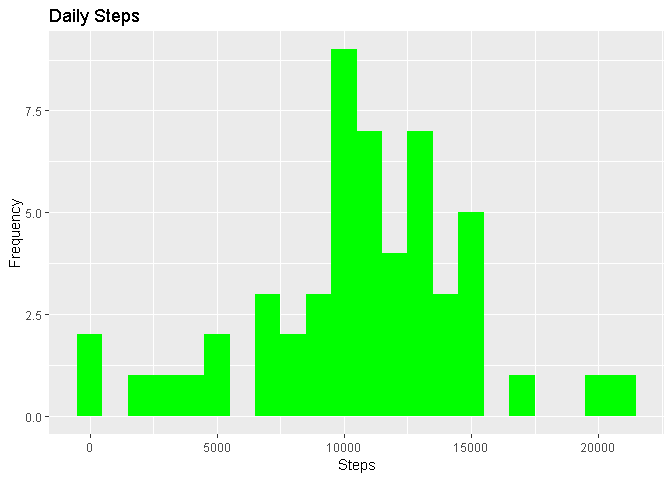
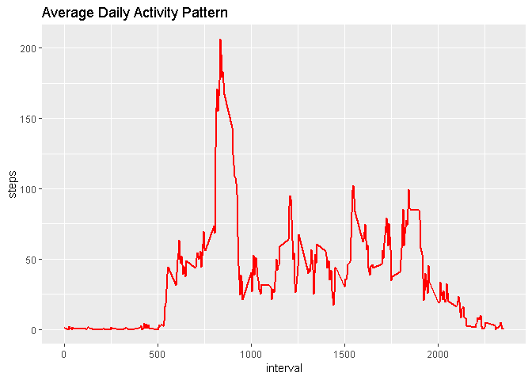
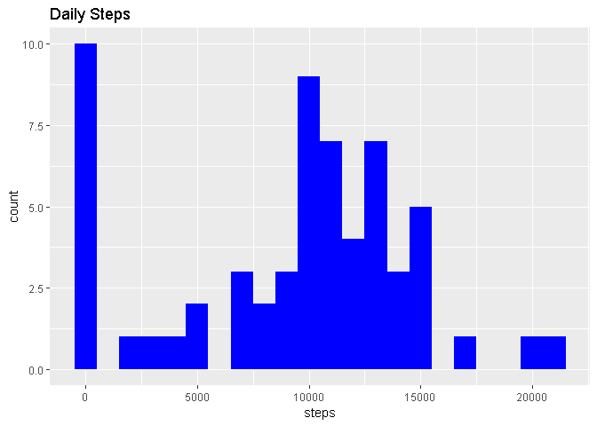
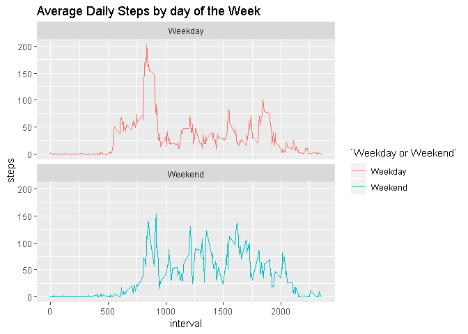

The following report will answer the questions concerning the week 2 project

#Loading and Preprocessing data


```r
library(data.table)
library(ggplot2)

fileURL <- "https://d396qusza40orc.cloudfront.net/repdata%2Fdata%2Factivity.zip"
download.file(fileURL, destfile = paste0(getwd(), "/repdata%2Fdata%2Factivity.zip"), method = "curl")
unzip("repdata%2Fdata%2Factivity.zip", exdir = "Data")
```

##Reading CSV file with the Data Table Package


```r
activityData <- data.table::fread(input = "Data/activity.csv")
```

#What is mean total number of steps taken per day?            

##Calculate the total number of steps taken per day


```r
totalSteps <- activityData[, c(lapply(.SD, sum, na.rm = FALSE)), .SDcols = c("steps"), by = .(date)]
head(totalSteps, 10)
```

```
##           date steps
##  1: 2012-10-01    NA
##  2: 2012-10-02   126
##  3: 2012-10-03 11352
##  4: 2012-10-04 12116
##  5: 2012-10-05 13294
##  6: 2012-10-06 15420
##  7: 2012-10-07 11015
##  8: 2012-10-08    NA
##  9: 2012-10-09 12811
## 10: 2012-10-10  9900
```
   
##Make a histogram of the total number of steps taken each day


```r
ggplot(data = totalSteps, aes(x = steps)) + geom_histogram(fill = "green", binwidth = 1000) + labs(x = "Steps", y = "Frequency", title = "Daily Steps")
```

```
## Warning: Removed 8 rows containing non-finite values (stat_bin).
```

<!-- -->

##Calculate and report the mean and median of the total number of steps taken per day


```r
totalSteps[, .(Mean_Steps = mean(steps, na.rm = TRUE), Median_Steps =  median(steps, na.rm = TRUE))]
```

```
##    Mean_Steps Median_Steps
## 1:   10766.19        10765
```

#What is the average daily activity pattern?

##Make a time series plot (i.e. \color{red}{\verb|type = "l"|}type="l") of the 5-minute interval (x-axis) and the average number of steps taken, averaged across all days (y-axis)


```r
intervalData <- activityData[, c(lapply(.SD, mean, na.rm = TRUE)), .SDcols = c("steps"), by = .(interval)]
ggplot(intervalData, aes(x = interval, y = steps)) + geom_line(color = "red", size = 1) + labs(xlab = "Interval", ylab = "Average Steps per Day", title = "Average Daily Activity Pattern")
```

<!-- -->

##Which 5-minute interval, on average across all the days in the dataset, contains the maximum number of steps?


```r
intervalData[steps == max(steps), .(max_interval = interval)]
```

```
##    max_interval
## 1:          835
```

#Imputing missing values

##Calculate and report the total number of missing values in the dataset (i.e. the total number of rows with \color{red}{\verb|NA|}NAs)


```r
nrow(activityData[is.na(steps),])
```

```
## [1] 2304
```

##Devise a strategy for filling in all of the missing values in the dataset. The strategy does not need to be sophisticated. For example, you could use the mean/median for that day, or the mean for that 5-minute interval, etc.


```r
activityData[is.na(steps), "steps"] <- activityData[, c(lapply(.SD, median, na.rm = TRUE)), .SDcols = c("steps")]
```
   
##Create a new dataset that is equal to the original dataset but with the missing data filled in.


```r
data.table::fwrite(x = activityData, file = "data/filledData.csv", quote = FALSE)
```

##Make a histogram of the total number of steps taken each day and Calculate and report the mean and median total number of steps taken per day. Do these values differ from the estimates from the first part of the assignment? What is the impact of imputing missing data on the estimates of the total daily number of steps?


```r
totalSteps2 <- activityData[, c(lapply(.SD, sum)), .SDcols = c("steps"), by = .(date)]
totalSteps2[, .(meanSteps = mean(steps), medianSteps = median(steps))]
```

```
##    meanSteps medianSteps
## 1:   9354.23       10395
```

```r
ggplot(totalSteps2, aes(x = steps)) + geom_histogram(fill = "blue", binwidth = 1000) + labs(title = "Daily Steps", xlab = "Steps", ylab = "Frequency")
```

<!-- -->
#Are there differences in activity patterns between weekdays and weekends?

##Create a new factor variable in the dataset with two levels - "weekday" and "weekend" indicating whether a given date is a weekday or weekend day.


```r
activityData <- data.table::fread(input = "data/activity.csv")
activityData[, date := as.POSIXct(date, format = "%Y-%m-%d")]
activityData[, `Day of the Week` := weekdays(x = date)]
activityData[grepl(pattern  = "Monday|Tuesday|Wednesday|Thursday|Friday", x = `Day of the Week`), "Weekday or Weekend"] <- "Weekday"
activityData[grepl(pattern  = "Saturday|Sunday", x = `Day of the Week`), "Weekday or Weekend"] <- "Weekend"
activityData[, `Weekday or Weekend` := as.factor(`Weekday or Weekend`)]
print(activityData, type = "html")
```

```
##        steps       date interval Day of the Week Weekday or Weekend
##     1:    NA 2012-10-01        0          Monday            Weekday
##     2:    NA 2012-10-01        5          Monday            Weekday
##     3:    NA 2012-10-01       10          Monday            Weekday
##     4:    NA 2012-10-01       15          Monday            Weekday
##     5:    NA 2012-10-01       20          Monday            Weekday
##    ---                                                             
## 17564:    NA 2012-11-30     2335          Friday            Weekday
## 17565:    NA 2012-11-30     2340          Friday            Weekday
## 17566:    NA 2012-11-30     2345          Friday            Weekday
## 17567:    NA 2012-11-30     2350          Friday            Weekday
## 17568:    NA 2012-11-30     2355          Friday            Weekday
```

##Make a panel plot containing a time series plot (i.e. \color{red}{\verb|type = "l"|}type="l") of the 5-minute interval (x-axis) and the average number of steps taken, averaged across all weekday days or weekend days (y-axis). See the README file in the GitHub repository to see an example of what this plot should look like using simulated data.


```r
activityData[is.na(steps), "steps"] <- activityData[, c(lapply(.SD, median, na.rm = TRUE)), .SDcols = c("steps")]
intervalData <- activityData[, c(lapply(.SD, mean, na.rm = TRUE)), .SDcols = c("steps"), by = .(interval, `Weekday or Weekend`)]

ggplot(intervalData, aes(x = interval, y = steps, color = `Weekday or Weekend`)) + geom_line() + labs(title = "Average Daily Steps by day of the Week", xlab = "Interval", ylab = "Frequency") + facet_wrap(~`Weekday or Weekend`, ncol = 1, nrow = 2)
```

<!-- -->

